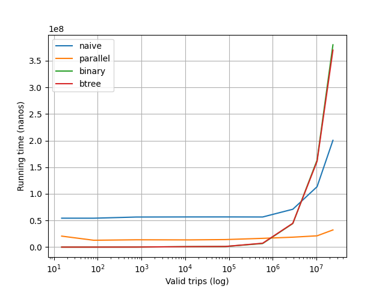

# NYTAXI

This project is an implementation of various ways to analyze the dataset of New York taxi rides.
The goal is to calculate a breakdown of average `trip_distance` by `passenger_count` in the given time interval as 
efficiently as possible.

## Comparison of implementations
All the implementations of the `AverageDistances.java` interface described below load the dataset into 
memory to speed up calculations. The borders of a given interval of interest will be further refered to as `start` and 
`end`.

### Naive
_Implementation class_: `NaiveAverageDistances.java`

The `NaiveAverageDistances.java` provides an implementation that simply iterates through all trips sequentially 
and calculates the average `trip_distance` of valid ones.

### Parallel
_Implementation class_: `ParallelAverageDistances.java`

Similarly to the naive approach, this one also iterates over all trips, but in a multithreaded way. 
The array of trips is divided into blocks, depending on the number of launched threads, and then each
thread calculates the average of `trip_distance` of its block. Once the computations are finished, the results are 
combined to calculate the answer.

### Binary search
_Implementation class_: `BinarySearchAverageDistances.java`

In this approach the array of trips is firstly sorted by `tpep_pickup_datetime`. Then binary search is used to calculate
the index of a lower bound of `start`. After that, all trips with index greater than the index of a lower bound are 
traversed while `tpep_pickup_datetime < end`.

### BTree
_Implementation class_: `BTreeAverageDistances.java`

On large arrays, searching for a lower bound using a BTree can be faster than using binary search. The idea is that if
you put a BTree in an array, while searching you will get much more processor cache hits in comparison with ordinary 
binary search. See:
- https://pvk.ca/Blog/2012/07/30/binary-search-is-a-pathological-case-for-caches/ 
- https://en.algorithmica.org/hpc/data-structures/binary-search/

To apply this approach for our task, we firstly sort the array of trips by `tpep_pickup_datetime`. Then we use some 
additional memory to construct a BTree array of `tpep_pickup_time to trip_index` pairs. We use this BTree
to find a lower bound index of a given `start`. After that we calculate the answer similarly to how it is done in the
binary search approach.

### Result


For our task the binary search and BTree approach have almost identical running times. This can happen because most of 
the time is spent on visiting trips and searching for valid ones and not on the lower bound search. Both of these 
approaches outperform the naive and parallel ones, when the number of trips that fit in an interval is much less than 
the number of all trips. On the other hand, when the number of valid trips is close to the number of all trips, 
the binary search and BTree approaches are slower than other approaches, because they have to do additional work 
prior to visiting the whole dataset. In this case the parallel approach is the fastest one.

## Building
```
./gradlew assemble
```

## Running benchmark
The benchmark result csv files are located in the `benchmark/` directory.
```
./gradlew run
```

## Testing
```
./gradlew test
```

All of the implementations are tested with 3 abstract test fixtures:
- `AbstractInterfaceTest.java` - tests `AverageDistances.java` interface invariants
- `AbstractRealDataTest.java` and `AbstractSmokeTest.java` test calculation correctness. These tests load the given
interval from the corresponding `.in` file, then they load the data from the appropriate `trips.csv` and create a
temporary parquet file.
After that they run the computation with the given implementation and compare the result with the corresponding `.out` 
file.

## Further research
- How the data can be processed if it doesn't fit in memory and what would be the most efficient approach?
- BTree configuration: try different sizes of a block + binary search for in-block searching.
